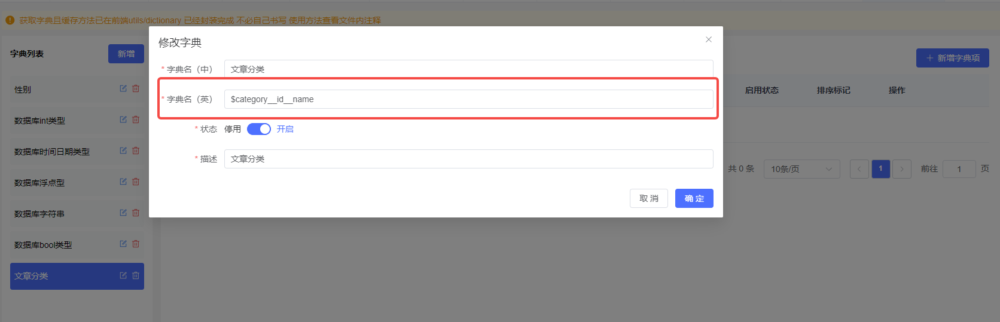

# 开发文档

## 特点

1. [x] 基于gin-vue-admin v2.6.0
2. [x] 支持代码生成表关联查询
3. [x] 支持代码生成同步设置菜单和api权限

## 开发方式

> 字典映射表

表达式

```
$table__value__label
```

| 字典类型   | 字典值   | 字典标签   |
|--------|-------|--------|
| table  | value | label  |

将category表的id映射到字典value，name映射到字典label



实现效果


## 代码生成器

### 前端部分

找到代码生成的组件

> web/src/view/systemTools/autoCode/component/fieldDialog.vue

替换template部分的代码

```vue
<template>
  <div>
    <warning-bar
        title="id , created_at , updated_at , deleted_at 会自动生成请勿重复创建。搜索时如果条件为LIKE只支持字符串"
    />
    <el-form
        ref="fieldDialogFrom"
        :model="middleDate"
        label-width="120px"
        label-position="right"
        :rules="rules"
        class="grid-form"
    >
      <el-form-item label="Field名称" prop="fieldName">
        <el-input
            v-model="middleDate.fieldName"
            autocomplete="off"
            style="width: 80%"
        />
        <el-button
            style="width: 18%; margin-left: 2%"
            @click="autoFill"
        >
          <span style="font-size: 12px">自动填充</span>
        </el-button>
      </el-form-item>
      <el-form-item label="Field中文名" prop="fieldDesc">
        <el-input v-model="middleDate.fieldDesc" autocomplete="off" />
      </el-form-item>
      <el-form-item label="FieldJSON" prop="fieldJson">
        <el-input v-model="middleDate.fieldJson" autocomplete="off" />
      </el-form-item>
      <el-form-item label="隐藏字段" prop="hideTable">
        <el-switch v-model="middleDate.hideTable" />
      </el-form-item>
      <el-form-item label="表格长度" prop="tableWidth">
        <el-input v-model="middleDate.tableWidth" autocomplete="off" />
      </el-form-item>
      <el-form-item label="校验规则" prop="rules">
        <el-input
            v-model="middleDate.rules"
            type="textarea"
            :rows="3"
            autocomplete="off"
        />
        <span>
          <a
              style="color: #f67207"
              target="_blank"
              href="https://element-plus.org/zh-CN/component/form.html#%E8%A1%A8%E5%8D%95%E6%A0%A1%E9%AA%8C"
          >参考ElementUI</a
          >
          ，例:
          <span
              @click="
              middleDate.rules =
                '[{ required: true, message: \'请输入内容\', trigger: \'blur\' }]'
            "
          >[{ required: true, message: '请输入内容', trigger: 'blur' }]</span
          >
        </span>
      </el-form-item>
      <el-form-item label="数据库字段名" prop="columnName">
        <el-input v-model="middleDate.columnName" autocomplete="off" />
      </el-form-item>
      <el-form-item label="数据库字段描述" prop="comment">
        <el-input v-model="middleDate.comment" autocomplete="off" />
      </el-form-item>
      <el-form-item label="Field数据类型" prop="fieldType">
        <el-select
            v-model="middleDate.fieldType"
            style="width: 100%"
            placeholder="请选择field数据类型"
            clearable
            @change="clearOther"
        >
          <el-option
              v-for="item in typeOptions"
              :key="item.value"
              :label="item.label"
              :value="item.value"
          />
        </el-select>
      </el-form-item>
      <el-form-item
          :label="middleDate.fieldType === 'enum' ? '枚举值' : '类型长度'"
          prop="dataTypeLong"
      >
        <el-input
            v-model="middleDate.dataTypeLong"
            :placeholder="
            middleDate.fieldType === 'enum'
              ? `例:'北京','天津'`
              : '数据库类型长度'
          "
        />
      </el-form-item>
      <el-form-item label="Field查询条件" prop="fieldSearchType">
        <el-select
            v-model="middleDate.fieldSearchType"
            style="width: 100%"
            placeholder="请选择Field查询条件"
            clearable
        >
          <el-option
              v-for="item in typeSearchOptions"
              :key="item.value"
              :label="item.label"
              :value="item.value"
              :disabled="
              (middleDate.fieldType !== 'string' && item.value === 'LIKE') ||
              (middleDate.fieldType !== 'int' &&
                middleDate.fieldType !== 'time.Time' &&
                middleDate.fieldType !== 'float64' &&
                (item.value === 'BETWEEN' || item.value === 'NOT BETWEEN'))
            "
          />
        </el-select>
      </el-form-item>
      <el-form-item label="关联字典" prop="dictType">
        <span>多选模式</span>
        <el-switch
            v-model="middleDate.muilDictMode"
            style="width: 5%; margin-left: 2%"
        />
        <el-select
            v-model="middleDate.dictType"
            style="width: 100%"
            :disabled="
            middleDate.fieldType !== 'int' && middleDate.fieldType !== 'string'
          "
            placeholder="请选择字典"
            clearable
        >
          <el-option
              v-for="item in dictOptions"
              :key="item.type"
              :label="`${item.type}(${item.name})`"
              :value="item.type"
          />
        </el-select>
        <span
        >当关联动态字典时，可以定义字典名（英）$table__value__lable方式生成代码，例:
          $user_type__id__name</span
        >
      </el-form-item>
      <el-form-item label="是否可清空">
        <el-switch v-model="middleDate.clearable" />
      </el-form-item>
    </el-form>
  </div>
</template>
```

### 后端部分

找到字典查询的接口

```
/sysDictionary/findSysDictionary
```

文件入口并找到FindSysDictionary的方法

> server/api/v1/system/sys_dictionary.go

```
// FindSysDictionary
// @Tags      SysDictionary
// @Summary   用id查询SysDictionary
// @Security  ApiKeyAuth
// @accept    application/json
// @Produce   application/json
// @Param     data  query     system.SysDictionary                                       true  "ID或字典英名"
// @Success   200   {object}  response.Response{data=map[string]interface{},msg=string}  "用id查询SysDictionary"
// @Router    /sysDictionary/findSysDictionary [get]
func (s *DictionaryApi) FindSysDictionary(c *gin.Context) {
	var dictionary system.SysDictionary
	err := c.ShouldBindQuery(&dictionary)
	if err != nil {
		response.FailWithMessage(err.Error(), c)
		return
	}
	sysDictionary, err := dictionaryService.GetSysDictionary(dictionary.Type, dictionary.ID, dictionary.Status)
	if err != nil {
		global.GVA_LOG.Error("字典未创建或未开启!", zap.Error(err))
		response.FailWithMessage("字典未创建或未开启", c)
		return
	}
	response.OkWithDetailed(gin.H{"resysDictionary": sysDictionary}, "查询成功", c)
}
```

我们需要重新定义字典查询的逻辑dictionaryService.GetSysDictionary

文件入口并找到GetSysDictionary的方法

> server/service/system/sys_dictionary.go

替换GetSysDictionary的方法

```go
func (dictionaryService *DictionaryService) GetSysDictionary(Type string, Id uint, status *bool) (sysDictionary system.SysDictionary, err error) {
// 判断Type第一个字母是不是$
if Id > 0 || Type[0] != '$' {
err = global.GVA_DB.Where("(type = ? OR id = ?) and status = ?", Type, Id, true).Preload("SysDictionaryDetails", "status = ?", true).First(&sysDictionary).Error
} else {
err = global.GVA_DB.Where("(type = ? OR id = ?) and status = ?", Type, Id, true).First(&sysDictionary).Error
if err != nil {
return
}

// 分割字符串Type为数组
list := strings.Split(Type, "__")
table := list[0][1:]
key := list[1]
value := list[2]
err = global.GVA_DB.Raw(fmt.Sprintf("SELECT %s as value, %s as label from %s", key, value, table)).Scan(&sysDictionary.SysDictionaryDetails).Error
}

return
}
```

### 扩展

> 在autocode接口添加菜单和权限

[sys_auto_code.go](server%2Fapi%2Fv1%2Fsystem%2Fsys_auto_code.go)

## 小程序开发基础

### 后端

> 复制以下文件夹到项目根目录

> [pkg](server%2Fpkg) 工具
> 
> [common](server%2Fcommon) 公共
> 
> [constants](server%2Fconstants) 常量
> 
> [jobs](server%2Fjobs) 任务

补全所需的配置信息

> server/config/config.yaml

```yaml
wechat:
    app-id:  # 小程序appid
    app-secret:     # 小程序密钥
    public-app-id:  # 公众号appid
    public-app-secret:     # 公众号appsecret
```

复制以下文件到server/config

> [wechat.go](server%2Fconfig%2Fwechat.go)

复制以下文件到server/initialize

> [wechat.go](server%2Finitialize%2Fwechat.go)

在Config结构体中添加Wechat字段

> server/config/config.go

```go
// 微信
Wechat Wechat `mapstructure:"wechat" json:"wechat" yaml:"wechat"`
```

添加WechatConfig *tools.WxConfig到全局变量(为了方便获取微信配置信息)

> server/global/global.go

```go
var (
    ……
	WechatConfig *tools.WxConfig
)
```

在server/core/server.go中添加初始化

```go
func RunWindowsServer() {
……
// 从db加载jwt数据
if global.GVA_DB != nil {
system.LoadAll()
}

// 微信配置初始化
initialize.WechatInit()
// 初始化任务
jobs.CronInit()

Router := initialize.Routers()
……
```